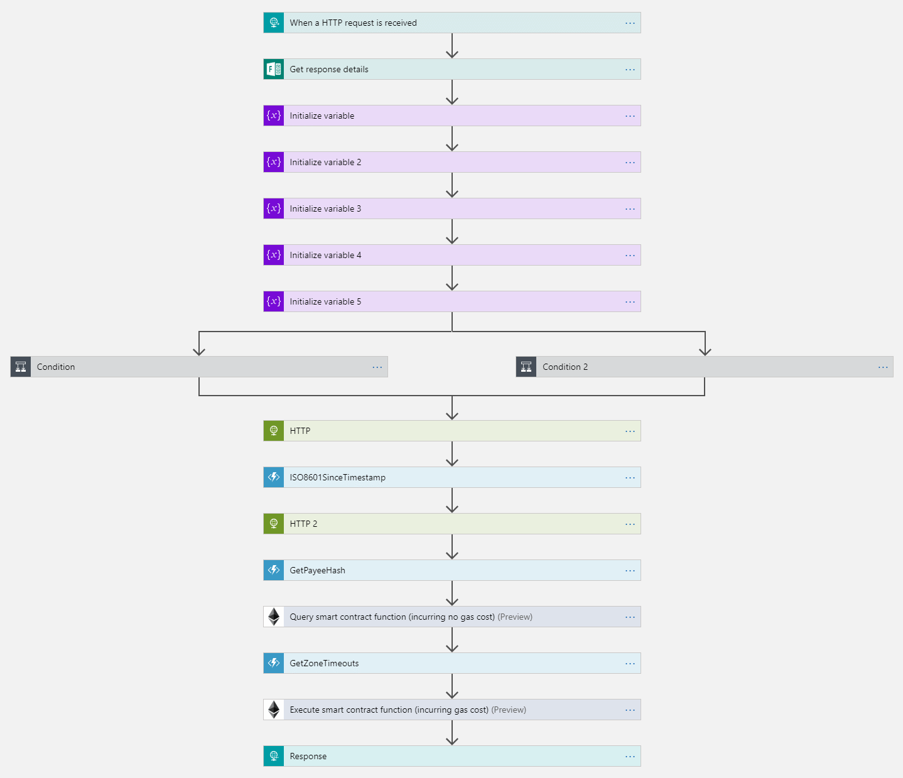
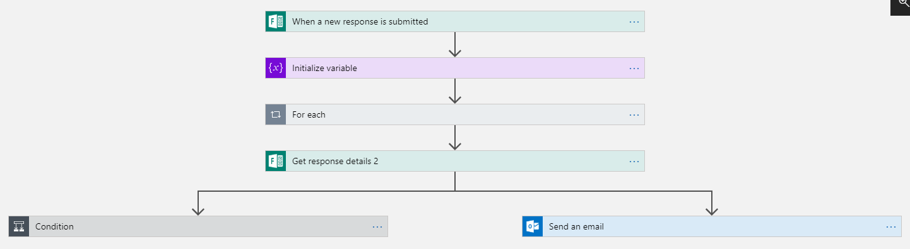
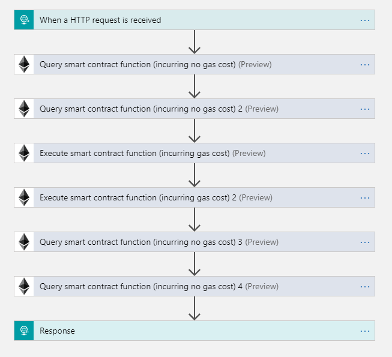
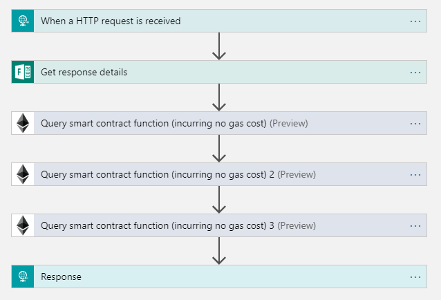
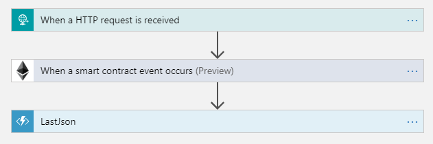
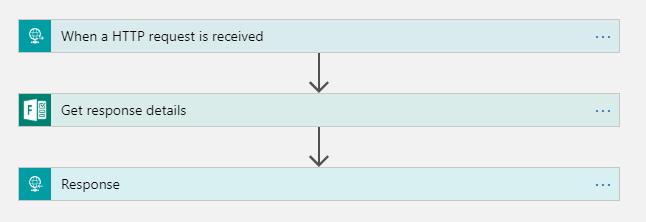
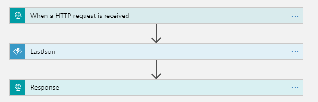
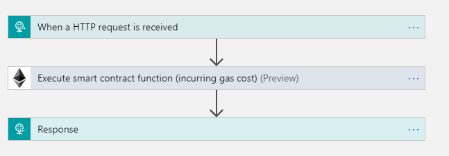

# Gamified Citizen Toll Enforcement

> **Quick Links**
>
> Please do read through the rest of this write-up to understand what's behind these links.
>
> * [ReactJS demo app (off of GitHub pages in original repo)](https://jakubner.github.io/bc-community-samples/toll-device-app/dist/index.html)
> * [City onboarding form](https://forms.office.com/Pages/ResponsePage.aspx?id=3Lt3--vGs02UAOXn9NV_scwAE4PWTPxFg9B_QZcw6HlUODhJNlNKT1VGVElRSlRTMUFCV0NaSDNIMC4u)
> * [Azure Logic Apps and Functions](azure)
> * [Ethereum contract](contract)
> * [overhide.io](https://overhide.io) (used for payment)

## Introduction

This demo app was created as a submission to the Ethereal Hackathon (2019):

* https://gitcoin.co/issue/Azure-Samples/bc-community-samples/18/2847
* https://github.com/Azure-Samples/bc-community-samples/issues/18

The demo app aims to "...simulate a toll payment for an automobile [using Azure and Ethereum contracts]." 

This is a demo of several things:

1. leveraging Microsoft's [Azure](https://azure.microsoft.com/en-us/) "serverless" for [Ethereum smart-contract interaction](https://docs.microsoft.com/en-us/connectors/blockchainethereum/)
    * smart-contract deployment via [Azure](https://azure.microsoft.com/en-us/) 
    * Azure Logic Apps and Functions with trusted off-chain functionality supporting the smart-contract
    * smart-contract state-transitions funneled through [Azure](https://azure.microsoft.com/en-us/)
    * smart-contract used by many anonymous entities
        * cars 
        * citizen bounty hunters
1. leveraging Microsoft's [Azure](https://azure.microsoft.com/en-us/) "serverless" backend with [overhide's](https://overhide.io) [remuneration APIs]()
    * no need to write own backend code
    * multi-currency support: fiat and crypto

## Background & Motivation

The usual example of vehicle toll payments we see (at least in North America) is a fee levied for distance-based linear segments of major highways, bridges, tunnels.  These are easy infrastructure components to monetize in a centralized fashion as vehicles are funneled in, out, and gated.

I set out to innovate on the idea of toll-collection using decentralization and to not limit the solution to infrastructure that cen be easily gated.

Consider a city that wants to levy a toll fee on car access to certain zones in the city.  It's not feasible to funnel cars within a city: this is not how our cities are built and connected.  

Although toll booths can certainly be setup as checkpoints within the city where it makes sense, our solution applies regardless of them being in the picture.

Consider our grand city below.  The city has three zones:

* Zone A: downtown (destination: city hall)
* Zone B: midtown (destinations: hospital, library, office)
* Zone C: uptown (destinations: schoo, factory)
* not zoned: suburbs

There are different toll fees for vehicles present in each zone, no toll fees in the suburbs.

The toll fees can be checked anywhere in the zone:

1. authorized (by city *Traffic Authority*) traffic checkpoints for moving traffic (toll booths) 
1. anywhere for static traffic (parked for at least a couple minutes)

Checkpoints (1) can be done centrally by the city using Azure's backend.  Although all the Azure functionality is present in this source code, this isn't the main concern addressed in the demo and the rest of this write-up.

Static traffic (2) within a zone can be toll-checked by anyone; decentralized, incentivized, and pseudonymous. 

### Values

The participants in this system are:

1. *the car* -- or driver by-proxy
1. *the citizen bounty hunter* -- individual toll checking throughout city (not at checkpoint)
1. *the Traffic Authority* -- representatives of the city doing enforcement (roaming + checkpoints)

The components of the system are:

1. *the Azure backend* -- central verification and validation of permit payments, configuration, administration
1. *the Ethereum blockchain* -- contract auditing zone permits, transgression reports, ticket issuance

With respect to *the car* (driver) the system:

* expects an Ethereum address QR code visible on the driver side of the windshield (picked up with QR code scanner)
    * alternatively could be some near-field electronic tag on the driver side (picked up by proximity)
    * needs to be controlled from inside of car but available to the outside
    * car's Ethereum address not tied to the city or any authority: not registered
* expects that while the car is in a "toll" zone; the displayed Ethereum address has a valid permit in the city's Ethereum smart-contract 
    * a valid paid-permit being a non-expired entry from the car's furnished Ethereum address
    * each permit has a limited validity time-period
    * a permit is not a payment--just an expiry timestamp with metadata--no Ethereum based value transfer
* expects that a valid permit is topped-up via dollars, ethers, or any other form of payment
    * top-up payments for permits are processed by the city's Azure backend cluster
* provides enforcement accountability: a means to audit time, location, and existence of transgression reports and tickets
    * built into Ethereum contract
    * no Ethereum events, no grounds for a ticket
    * Ethereum contract is a vessel for accountability, requires human judgement for resolution
* provides convenience
    * no need to register with the city: perfect for out-of-town tourists
    * flexibility of toll fee payment currency
* provides fees payment accountability
    * permits can be checked on Ethereum blockchain
    * payments can be checked on any ledger supported by [overhide.io](https://overhide.io)

With respect to *the citizen bounty hunter* the system:

* provides pseudonimity
    * they are Ethereum public addresses
    * stakes and bounties *do* involve value transfer on the Ethereum blockchain
* provides decentralization
    * hunters interact with system outside of the city Traffic Authority's Azure backend
* expects honesty 
    * bount hunters do risk a staked amount of ethers when reporting 

With respect to *the Traffic Authority* the system:

* provides easy onboarding and deployment
    * a new Ethereum contract can be provisioned for a new city [via a Microsoft form](https://forms.office.com/Pages/ResponsePage.aspx?id=3Lt3--vGs02UAOXn9NV_scwAE4PWTPxFg9B_QZcw6HlUODhJNlNKT1VGVElRSlRTMUFCV0NaSDNIMC4u)
    * same Azure workflows can apply to many different cities
    * Toll Enforcement as a Service (TEaaS)
* provides inexpensive addition of currencies (Euros, BitCoin, DAI)
    * no code adjustment1 in the user facing ReactJS apps ([ledgers.js](https://www.npmjs.com/package/ledgers.js))
    * no code adjustment1,2 in the Azure backend as abstracted from remuneration using overhide's [remuneration APIs](https://www.npmjs.com/package/ledgers.js#3-ecosystem)
* expects no collection of personally identifiable information by the city Traffic Authority
    * the city Traffic Authority knows entities paying for toll access (cars/drivers) only as [overhide.io](https://overhide.io) furnished pseudonymous public addresses
        * this, even for dollars:
        * the [Stripe](https://stripe.com) is the payment gateway storing personally identifiable information
        * the [overhide.io](https://overhide.io) APIs enable pseudonymous [ledger-based authorizations](https://www.youtube.com/watch?v=moc1P9W0yTk)
    * the city Traffice Authority doesn't know who the citizen bounty hunters are
        * Ethereum public addresses
        * stakes and bounties *do* involve value transfer on the Ethereum blockchain

> Notes
>
> 1 the demo in this repo has a hardcoded fees-schedule configuration for dollars and ethers in three payment zones; this demo wasn't written in a generic way to require "no code adjustments"
> 2 as of this writing only dollars and ethers are abstracted via overhide's [remuneration APIs](https://www.npmjs.com/package/ledgers.js#3-ecosystem), additional currencies would require authoring and standing up implementation of the APIs for those currencies; it's just two endpoints (see [sample swagger](https://rinkeby.ethereum.overhide.io/swagger.html))

## Benefits

The city traffic authority works with their trusted secure workflows on Azure.  They keep their costs down by not implementing and running their own backend infrastructure.  The city can contract out for software development work focused on the functionality and not plumbing.

The Azure backend is a perfect place to validate toll top-up payments.  Since the city accepts multiple currencies from toll-payers (via *zone topup app*), the top-up payments are not value-transfers within the system's Ethereum contract.  The city keeps implementation, data-management, and liability costs down by leveraging [ledger-based authorizations]((https://www.youtube.com/watch?v=moc1P9W0yTk)) with Azure as the backend.

The city further saves on enforcement.  The enforcement officers' job is highly automated through the Ethereum contract event log.  The audit trail left by the Ethereum evnet log keeps toll violator litigation costs down to a minimum.

The drivers benefit by not having to register their cars--having to deal with any bureaucracy.  Both locals and out-of-town tourists can just as quickly onboard with the *zone topup app* and drive in.  No special hardware for the drivers to acquire--no transponders or costly or fickle GPS trackers--just a QR code in the right spot behind the windshield.  Flexibility of payment (for tolls) furthers the city's mission to be accessible to all.

The car's location is not easily trackable with the toll-system.  The driver's identity is not trackable with the toll-system.  The toll-system is focused on tolls and cannot be accused otherwise and displease privacy advocates.  

>NOTE: if using dollars to pay via *zone topup app* the driver's (payer's) identity is known through [Stripe](https://stripe.com) but that's out-of-band to the toll system.  The toll system only knows the driver as the topup Ethereum address from *ledger-based authorizations*.

Azure is in the critical path of top-ups, but not in the critical path of transgression checks and reports by citizen bounty hunters.

The bounty hunters are incentivized to participate for the rewards of finding toll-transgressors.  The incentive is sufficient for the bounty hunters to onboard with Ethereum and use their own access to the blockchain.  

Leveraging Ethereum means the bounty hunting *booth app* ecosystem is completely decoupled from the city's Azure APIs and can be ever richer with new features.  Deployment and provisioning of toll-checking booths--*booth apps*--is a non-issue.

None of the participants know each other.  Everyone is pseudonymous.  But everything is auditable.  The drivers are just a public address to the city.  The citizen bounty hunters are just a public address to the drivers and the city.

demonstrates how Azure can be leveraged by app developers who do not want to be in the business of managing people, writing backends (leverage Azure), but still want to get paid in cryptos or dollars

## Simulation / Demo

> NOTE:
>
> Your [web3.js](https://github.com/ethereum/web3.js/) injecting wallet (e.g. [MetaMask](https://metamask.io/)) must be connected to Rinkeby Ethereum testnet for the *Toll Bounty App* to work.
>
> *Car Top-Up App* doesn't need the wallet:  you can pay using dollars.  However, if a wallet is connected to Rinkeby the payment for ethers option will be enabled.

To run the demo you can either:

* visit [these forked GitHub pages](https://jakubner.github.io/bc-community-samples/toll-device-app/dist/index.html)
* build and run yourself:
    * sync repo
    * `npm run install`
    * `npm run build`
    * `npm run serve`
    * open *http://localhost:8080* with browser (or whatever port is indicated on command line)

The demo simulates three "apps" and the interaction between cars (drivers), citizen bounty hunters, and the city toll-enforcement officers:

The *Car Top-Up App* shows the Ethereum address of the car on the map.  Refreshing the browser will recycle the address.  This app has the Ethereum private-key for this address, since it simulates the car owning this address.  The driver uses this app to pay toll fees for their destination zone for some some time.  For this simulation the toll fees expire after two minutes.  The toll fee expiration timestamp is shown in the app.  

Simply choose to pay with dollars or ethers and proceed to pay the toll.  

> Dollars Payment
>
> Paying in dollars uses the test network from the [overhide-ledger](https://test.ohledger.com): which expects use of [Stripe's test credit cards](https://stripe.com/docs/testing#cards).
>
> For a test *VISA* simply:
>
> * Email: foo@bar.com
> * Verification Code (if shown): click the little back chevron (<) in the upper-left corner of modal to skip out
> * Card number: 4242 4242 4242 4242
> * MM/YY: 02/22 (any future date will do)
> * CVC: 222 (any number will do)

Once paid up (or not), click on a building in a city to drive to it.

A concerned citizen bounty hunter is roaming the city.  Click the little dude with a top-hat to go to wherever the car is (unless car is back in the suburbs).

Once the citizen bounty hunter is at the car, you can click the "click and report" button in the *Toll Bounty App*.  Unlike the *Car Top-Up App* which uses Azure APIs (see URLs in [src/config.json](src/config.json)), the *Toll Bounty App* goes straight to the Ethereum Rinkeby testnet as provided by your in-browser wallet.

If a bounty hunt was successful--i.e. the car had lapsed toll payment--the *Enforcement App* will indicate a dispatching of the enforcement officer.  This is done through Azure's Ethereum connector and Ethereum events.

> NOTE:
>
> For demo/simplicity, only the last [NewReport event](contract/contract.sol) is tracked in a single dispatch file via an [Azure Function (LastJson)](azure/functions/LastJson).  Multiple people using this demo at the same time will possibly make your enforcement officer go to the wrong location and/or looking for the wrong car address.  This is a funny, it's fine for this demo.

Beside a race condition in this simplistic dispatching mechanism, another way to avoid a ticket for violating toll-payment is to click another destination in the city and run away before the enforcement officer arrives.

Note that if the car runs away from a location before the enforcement officer arrives, not only does the citizen bounty hunter miss out on the reward from the ticket, the bounty hunter gives up their staked ethers for their mis-reporting: bounty hunters stake some ether when reporting a car.  As such, the citizen bounty hunter must be somewhat confident the car will stay where it is for some time.  The time is not unbounded; it's 30 seconds in the simulation.  In the real world this would be location dependent, but enforcement officers on bike or foot should be able to get to reports on the order of minutes and ticket cars in a matter of seconds ().

## Implementation

The *Car Top-Up App* is simulated by the [src/lib/CarPanel.jsx](src/lib/CarPanel.jsx) React component.  It interacts with [ledgers.js](https://www.npmjs.com/package/ledgers.js) and Azure all within the component.

The *Toll Bounty App* is simulated by the [src/lib/TollPanel.jsx](src/lib/TollPanel.jsx) React component.  It interacts with the injected [web3.js](https://github.com/ethereum/web3.js/) library.

The *Enforcement App* is simulated by the [src/lib/OfficerPanel.jsx](src/lib/OfficerPanel.jsx) React component.  It interacts with Azure.

All Azure Logic Apps are deployed as per the URLs in [src/config.json](src/config.json).  The Logic Apps can all be found in [azure/logic-apps](azure/logic-apps).  The Logic Apps depend on Azure functions as deployed from [azure/functions](azure/functions).

The Ethereum contract bringing everything together is in [contract/](contract).

The contract is instantiated by the [azure/logic-apps/toll-enforce-new-admin-form-email.json](azure/logic-apps/toll-enforce-new-admin-form-email.json) Logic App.  There is a [Microsoft Form](https://forms.office.com/Pages/ResponsePage.aspx?id=3Lt3--vGs02UAOXn9NV_scwAE4PWTPxFg9B_QZcw6HlUODhJNlNKT1VGVElRSlRTMUFCV0NaSDNIMC4u) which--when ran, re-deploys the contract and configures all new fees schedules for the city.  The details of the new fees schedule and the new Ethereum contract instance address are emailed to the email address specified in the [Microsoft Form](https://forms.office.com/Pages/ResponsePage.aspx?id=3Lt3--vGs02UAOXn9NV_scwAE4PWTPxFg9B_QZcw6HlUODhJNlNKT1VGVElRSlRTMUFCV0NaSDNIMC4u).

The configuration points emailed above need to be put into [src/config.json](src/config.json) to take effect:

* *admin__FormId*
* *ethereumContractAddress*

As such, many different "demo" cities can use the same setup to run the toll collecting operation.

> NOTE:
>
> Running through the form yourself will not interfere with deployed demo:  it's already running as per current deployment: idempotent.

The following figure models the workflows involved in the system:

## Appendix :: Logic Apps (screenshots)

### toll-enforce-topup

### toll-enforce-new-admin-form-email

### toll-enforce-admin

### toll-enforce-check

### toll-enforce-dispatch

### toll-enforce-get-admin

### toll-enforce-poll

### toll-enforce-reconcile

